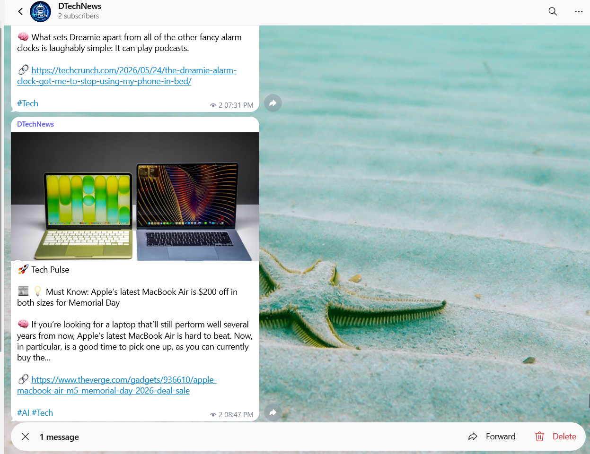

# Telegram Tech News Bot

Telegram Tech News Bot is an automated bot that fetches and posts the latest technology and AI-related news directly to a Telegram channel. The project is designed to provide fast and organized tech updates using automation workflows and API integrations.

Repository: https://github.com/coderDheeraj/telegram_tech_news_bot

---

## Preview



---

## Features

- Automated tech news posting
- AI and technology focused updates
- Telegram channel integration
- Scheduled news delivery
- API-based news fetching
- Lightweight and easy to deploy
- GitHub Actions automation support

---

## Technologies Used

- Python
- Telegram Bot API
- GitHub Actions
- REST APIs

---

## Workflow

1. Fetch latest technology news from APIs
2. Process and format news content
3. Automatically send updates to Telegram channel
4. Run scheduled automation using GitHub Actions

---

## Project Structure

```bash
telegram_tech_news_bot/
│
├── main.py
├── requirements.txt
├── assets/
│   └── images/
│       └── preview.png
│
├── .github/
│   └── workflows/
│       └── news_bot.yml
│
├── utils/
├── config/
└── README.md
```

---

## Installation

Clone the repository:

```bash
git clone https://github.com/coderDheeraj/telegram_tech_news_bot.git
```

Open the project directory:

```bash
cd telegram_tech_news_bot
```

Install dependencies:

```bash
pip install -r requirements.txt
```

---

## Environment Variables

Create a `.env` file and add the following variables:

```env
TELEGRAM_BOT_TOKEN=your_bot_token
TELEGRAM_CHAT_ID=your_chat_id
NEWS_API_KEY=your_api_key
```

---

## Running the Bot

```bash
python main.py
```

---

## GitHub Actions Automation

The project supports scheduled automation using GitHub Actions for continuous news posting.

Features include:

- Scheduled workflows
- Secure secret management
- Automated execution

---

## Future Improvements

- AI-generated summaries
- Multi-category news support
- Image support in Telegram posts
- Multiple Telegram channel support
- Admin dashboard
- Custom scheduling system

---

## Contributing

Contributions are welcome. Fork the repository and submit a pull request for improvements or additional features.

---

## License

This project is licensed under the MIT License.

---

## Developer

Dheeraj Jangid

GitHub: https://github.com/coderDheeraj
